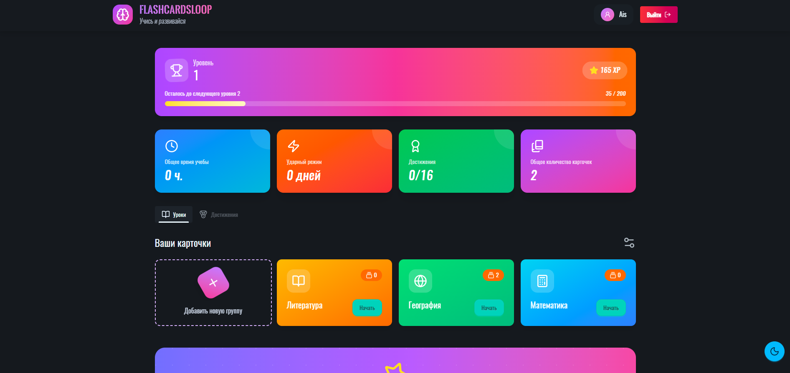
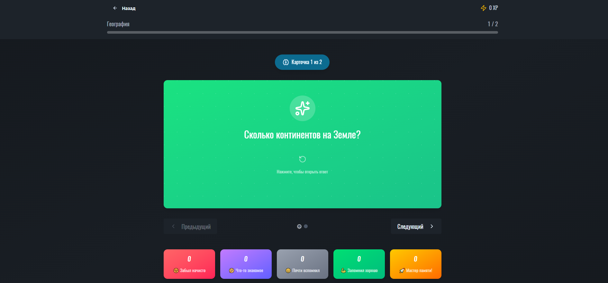
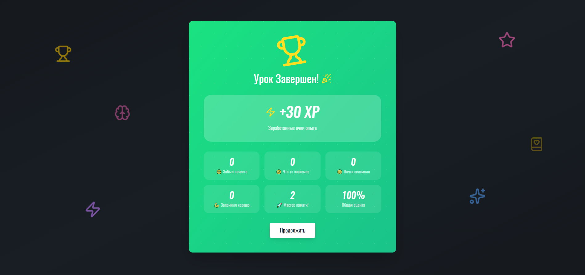
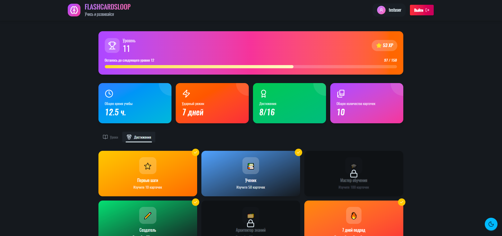
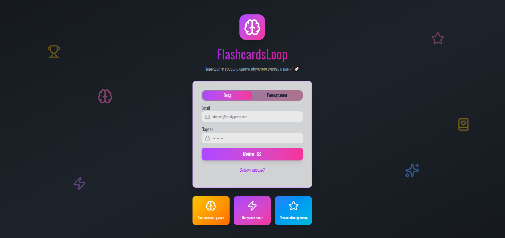
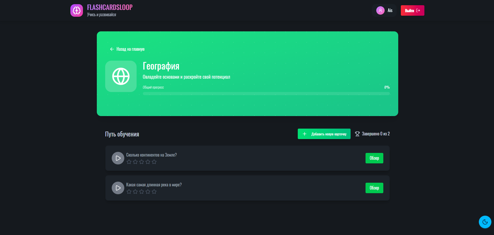

# 🃏 FlashcardsLoop

**Умное приложение для изучения карточек с геймификацией и системой достижений**

---

## 📖 О приложении

FlashcardsLoop - это современное веб-приложение для эффективного запоминания информации с помощью карточек. Создавайте свои наборы карточек, изучайте их в удобном формате и отслеживайте свой прогресс с помощью детальной статистики.

### ✨ Основные возможности

- 🎴 **Карточки для запоминания** — создавайте карточки с вопросом и ответом для изучения любой информации
- 📁 **Группы** — организуйте карточки по темам (английский, испанский, программирование и т.д.)
- ⭐ **Система оценок** — оценивайте свои знания от 1 до 5 звёзд после изучения каждой карточки
- 📊 **Детальная статистика** — отслеживайте прогресс, время обучения и количество изученных карточек
- 🏆 **Достижения** — получайте награды за свои успехи (streak, количество карточек, уровни)
- 🎯 **Уровни и XP** — прокачивайте свой уровень, зарабатывая опыт за изучение
- 🔥 **Streak система** — мотивируйте себя заниматься каждый день подряд
- ⚙️ **Настройки изучения** — настраивайте количество карточек, порядок показа и фильтры

---

## 🎮 Геймификация

Приложение превращает обучение в увлекательную игру:

### 💎 Система опыта (XP)
- Получайте XP за каждую изученную карточку
- Чем выше оценка (1-5 звёзд), тем больше XP
- Бонусы за streak — занимайтесь подряд и получайте дополнительный XP

### 🏅 Уровни
- Повышайте свой уровень, набирая опыт
- Каждый новый уровень требует больше XP
- Отслеживайте прогресс до следующего уровня

### 🔥 Streak (серия дней)
- Занимайтесь каждый день подряд
- Увеличивайте свою серию для бонусного XP
- Побейте свой рекорд!

### 🏆 Достижения
Разблокируйте достижения разной редкости:
- **Common** (Обычные) — первые шаги
- **Rare** (Редкие) — серьёзный прогресс
- **Epic** (Эпические) — впечатляющие результаты
- **Legendary** (Легендарные) — для настоящих мастеров

**Типы достижений:**
- За количество созданных карточек
- За количество изученных карточек
- За streak (дни подряд)
- За набранный опыт
- За достижение определённого уровня
- За время обучения
- За серию идеальных оценок (5 звёзд)

---

## 📸 Скриншоты

## 🎯 Основные функции

### Создание и управление карточками
- Создавайте карточки с лицевой и обратной стороной
- Организуйте их в группы по темам
- Добавляйте цвета и иконки для групп
- Меняйте порядок групп перетаскиванием (drag & drop)

### Процесс изучения
- Начинайте сессию изучения для любой группы
- Настраивайте количество карточек за сессию (от 5 до 50)
- Выбирайте порядок показа: по дате создания, рейтингу или случайно
- Фильтруйте карточки по оценке (показывать только сложные)
- Оценивайте свои знания от 1 до 5 звёзд

### Статистика и прогресс
- **Общий опыт (XP)** — сколько всего заработали
- **Текущий уровень** — ваш прогресс
- **Текущий streak** — сколько дней подряд занимаетесь
- **Лучший streak** — ваш рекорд
- **Время обучения** — сколько всего потратили времени
- **Карточек изучено** — общее количество
- **Карточек создано** — сколько контента добавили
- **Серия идеальных оценок** — сколько карточек подряд оценили на 5 звёзд

### История обучения
- Смотрите историю всех сессий изучения
- Отслеживайте какие группы изучали и когда
- Анализируйте свою активность

### Dashboard
- Вся важная информация на одном экране
- Профиль пользователя
- Текущая статистика
- Список групп с количеством карточек
- Все достижения со статусом разблокировки

---

## 🎨 Особенности

- 🌐 **Real-time уведомления** — мгновенные уведомления о разблокированных достижениях
- 📱 **Адаптивный дизайн** — работает на десктопе, планшете и мобильных устройствах
- 🔒 **Безопасность** — защищённая аутентификация с refresh tokens
- ⚡ **Быстрая работа** — оптимизированные запросы к базе данных
- 🎯 **Мотивация** — система рекомендаций достижений, которые скоро получите
- 📈 **Прогресс достижений** — отслеживайте прогресс к каждому достижению

---

## 🚀 Начало работы

1. **Зарегистрируйтесь** — создайте аккаунт
2. **Создайте группу** — добавьте первую группу карточек (например, "Английский")
3. **Добавьте карточки** — заполните группу карточками
4. **Начните изучение** — запустите сессию и оценивайте свои знания
5. **Получайте достижения** — прокачивайте уровень и разблокируйте награды!

---

## 💡 Советы для эффективного обучения

- 📅 **Занимайтесь регулярно** — сохраняйте streak для бонусного XP
- ⭐ **Честно оценивайте знания** — это поможет системе показывать нужные карточки
- 🎯 **Создавайте компактные карточки** — короткие вопросы запоминаются лучше
- 📊 **Следите за статистикой** — она покажет ваш реальный прогресс
- 🏆 **Гонитесь за достижениями** — они мотивируют продолжать обучение
- 🔥 **Не прерывайте streak** — даже 10 минут в день делают разницу!

---

## 📞 Связь

Нашли баг или есть предложение? Создайте Issue в репозитории!
- Telegram:
- Frondend [@aisblack] (https://t.me/aisblack)
- Backend [@bmbasharov](https://t.me/BMBasharov)
---

## 📄 Лицензия

MIT License — используйте свободно для личных и коммерческих проектов.

---

**Удачи в обучении! 🎓**
